## Systemarchitektur
### Überblick

Im folgenden ein kurzer Überblick über die Architektur der gesamten Applikation.


Im wesentlichen besteht die Applikation aus drei grossen teilen, namentlich die Engine, der Client sowie die Datenbank. Der Client ist das Program, welches vom Benutzer bedient wird. Es stehlt dem Benutzer eine graphische Oberfläche zu verfügung und sendet im Hintergrund die Abfragen an die Engine. Die Engine nimmt die Abfragen entgegen und verarbeitet diese in dem sie mit der Datenbank interagiert.

Die Kommunikation zwischen dem Client und der Engine läuft wie HTTP, genauer über eine REST-API. Die Antworten werden von der Api im Json-Format zurückgesendet.

### Engine

Die Engine ist sozusagen das Herzstück des Systems. Sie verarbeitet Abfragen in dafür entwickelten StockSearch-Query-Language, kurz SSQL. Die Engine wird in Python programmiert, da sich diese Sprache für Serveranwendungen gut eignet, sehr populär ist und zudem einfach zu lesen.

Für die Kommunikation via Http wird Flask verwendet, eine Microframework für Serveranwendungen mit Python. Zudem verwenden wir Modgrammar, eine freie Bibliothek fürs Parsing sowie Doctest und Pytest.

### Client

Der Client bietet dem Benützer eine Oberfläche um die Aktiendaten abzufragen, dazu erstellen wir eine Seite welche im Browser aufgerufen werden kann. Dies hat im Gegensatz zu einer nativen Programm den Vorteil, dass wir die Webtechnologien Javascript, Html und Css verwenden können, welche sehr geeignet sind um graphische Oberflächen zu erstellen. Zudem entspricht es dem allgemeinen Trend, dass immer mehr Programme im Browser bedient werden. Wir verwenden dazu JQuery und Bootstrap.

## Datenbank
### Datenbankmodel

Überblick über das Datenbankmodel


Die wichtigste Tabellen in unserem Datenbankmodel sind Share und ValueEntry. Vorher möchten wir allerdings einige Worte darüber schreiben, wieso wir die Tabelle Calendar benötigen.

Aktienbörsen sind nicht an jedem Tag im Jahr geöffnet. Deshalb liefern die verschiedenen Datenquellen auch keine Daten wenn die Börsen geschlossen sind wie beispielsweise am Wochenende. Deswegen führen wir eine Abstraktion für die den Kalender ein, indem wir die Tage einfach durchnummerieren. Wenn nun Beispielsweise der Freitag der Tag Nr. 100 hat, bekommt der darauf folgende Montag die Nr. 101. Somit können wir danach Abfragen bearbeiten wie, 'Was ist der Tag vor Nr. 101' und geben somit das gregorianische Datum des Tag Nr. 100 zurück.

Um die Integrität der Abfragen zu garantieren, führen wir die folgende Bedingung ein: Jede Aktie muss an jedem Tag im Kalender ein Eintrag haben. Dies ist ein pragmatischer Ansatz, denn wenn wir Lücken zulassen würden würden Abfragen wie "Change from x to y" keine klaren Antworten haben, wenn beispielsweise an x kein Wert verfügbar ist.

Da allerdings nicht jeder Aktientitel an jedem Tag einen Wert hat (Ausländische Börsen haben andere Feiertage) führen wir eine Gap-Filling-Policy ein. Diese ist so, dass wir immer der letzte verfügbare Wert nehmen. Damit klar ist, wie die Werte aufgefüllt wurden, benötigen wir das Feld origin in ValueEntry. Dort soll gespeichert werden ob ein Feld ein 'echter' Wert ist (genuine) oder gap-filled. Wenn eine Aktie nicht mehr verfügbar ist tragen wir den Wert 0 ein.

Da das Gap-Filling von MariaDB kaum unterstützt wird und deshalb sehr komplex und ineffizient ist, begnügen wir uns damit diese 0 Einträge normal in der Datenbank zu speichern.

## Datenquelle

Wir beziehen die Daten von der Firma Quandl (www.quandl.com). Genauer arbeiten wir mit dem Datensatz 'Swiss Exchange' (https://www.quandl.com/data/SIX-Swiss-Exchange).

Dazu verfügen wir über ein kostenloses Benutzerkonto welches uns täglich 50'000 Abfragen erlaubt. Die Daten beziehen wir über die bereitgestellte JSON-REST API. Da nicht alle 10'000 Aktientitel dieses Datensatzes interessant sind, wird eine Liste der Titel welche in StockSearch importiert werden geführt. Diese Liste liegt im liegt im csv Format vor.

### Initialisierung der Datenbank

Folgender Pseudocode zeigt, welche Schritte nötig sind um die Datenbank in einen Zustand zu bringen welcher alle Constraints erfüllt.

Die Schwierigkeit dabei ist, dass man zuerst den Kalender initialisieren muss, bevor die Daten in der Datenbank gespeichert werden können. Um den Kalender zu initialisieren müssen allerdings zuerst alle Daten vorliegen, denn damit kann man den Handelskalender rekonstruieren.

```
titels <= readCsv("titel.csv")
temp  <= createTemporaryTable()
db <= database()

# Download der Daten
for title in titels:
   data <= download(title)
   db.shares.insert(metadata(data))
   temp.insert(data)
   
# Erstellen des Kalenders
dates <= AllDistictDates(temp)
dates.sort()
counter <= 0
for date in dates:
   db.calendar.insert(counter, date)
   counter <= counter + 1


# Einfügen der Daten in die Datenbank inkl GapFilling
for entry in temp:
	 firstDate = db.shares.lookup(entry.id).firstDate
	 lastDate  = db.shares.lookup(entry.id).lastDate
	 value <= 0
    for day in range(0, counter):
    	 if date < firstDate or date > lastDate:
    	    value <= 0
    	 else if not hasValue(entry)
    	 else
    	    value <= entry.value
    	 db.date.insert(day, entry.id, value)
    	 
temp.delete()

```

## REST-Api

Die Engine stellt eine Rest-API zu verfügung um Abfragen zu senden.

**Allgemeines:**

- Es gibt keine Autorisierung der einkommenden Anfragen
- Resultate werden jeweils im Json-Format zurückgegeben

Die Api besteht aus nur einem Endpoint, und zwar um Queries durchzuführen.

### Query-Endpoint

**Url:**     /query/{ssql}

**Methode:**  GET

**Possible Response Codes:**

- 400 Bad Request (Ungültiges ssql Statement)
- 200 OK
- 500 Internal Error

Im Fall eines Fehlers wird eine Error-Response zurückgegeben. Wenn die Abfrage erfolgreich verarbeitet werden konnte, wird je nach Abfrage entweder eine Table-Response oder Detail-Response zurückgegeben.

#### Table-Response Sample

```
{
  "success": true,
  "type": "table",
  "data": [
    {
      "key": "micro",
      "name": "Microsoft",
      "isin": "300",
      "dataSource": "test",
      "currency": "TST",
      "description": "Bleibt konstant",
      "firstEntry": 1,
      "lastEntry": 4,
      "Value on 2018-01-01": 20,
      "Decimal 15.0": 15
    },
    {
      "key": "usb",
      "name": "UBS AG",
      "isin": "400",
      "dataSource": "test",
      "currency": "TST",
      "description": "Ist teuer",
      "firstEntry": 2,
      "lastEntry": 4,
      "Value on 2018-01-01": 130,
      "Decimal 15.0": 15
    }
  ],
  "sql": [
    "SELECT @var1 := `day` FROM `Calendar` WHERE `date` <= '2018-04-03' ORDER BY `date` DESC LIMIT 1",
    "Select * from `Share`, (SELECT `id` AS `key`, `value` AS `Value on @var1` FROM `ValueEntry` WHERE `day` = @var1) as f0, (SELECT `key` AS `key`, 15.0 AS `Decimal 15.0` FROM `Share`) as f1 where (`Share`.`key` = f0.`key`AND `Share`.`key` = f1.`key`) AND (f0.`Value on @var1` > f1.`Decimal 15.0`)"
  ],
  "ssql": "all shares where value > 15"
}
```

#### Detail-Response Sample

```
{
  "success": true,
  "type": "detail",
  "key": "micro",
  "name": "Microsoft",
  "isin": "300",
  "dataSource": "test",
  "currency": "TST",
  "description": "Bleibt konstant",
  "firstEntry": "2018-01-01",
  "lastEntry": "2018-01-06",
  "data": [
    {
      "value": 20,
      "date": "2018-01-01"
    },
    {
      "value": 20,
      "date": "2018-01-02"
    },
    {
      "value": 20,
      "date": "2018-01-05"
    },
    {
      "value": 20,
      "date": "2018-01-06"
    }
  ],
  "sql": [
    "SELECT v.`value`, c.`date` FROM `ValueEntry` AS v, `Calendar` AS c        WHERE v.`day` = c.`day` AND v.`id`='micro' ORDER BY v.`day` ",
    "SELECT s.`key`, s.`name`, s.`isin`, s.`dataSource`, s.`currency`, s.`description`, f.`date` AS firstEntry, l.`date` AS lastEntry FROM `Share` as s, `Calendar` as f, `Calendar` as l WHERE s.`firstEntry`=f.`day` AND s.`lastEntry`=l.`day` AND s.`key`='micro'"
  ],
  "ssql": "get 'micro'"
}
```
#### Error-Response Sample

```
{
  "success": false,
  "type": "error",
  "ssql": "all",
  "error": "[line 1, column 1] Expected 'all shares where ' or 'all shares' or 'get': Found 'all'"
}
```

##Client Web Application
###Search Mode

####Advance Mode
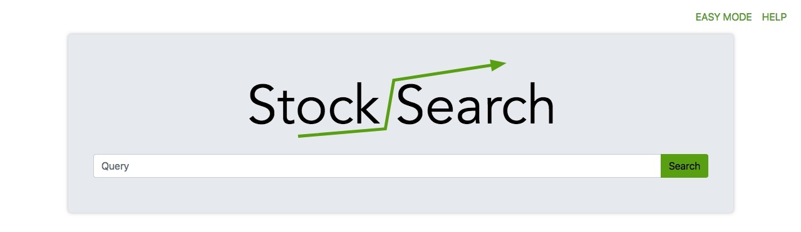

####Easy Mode

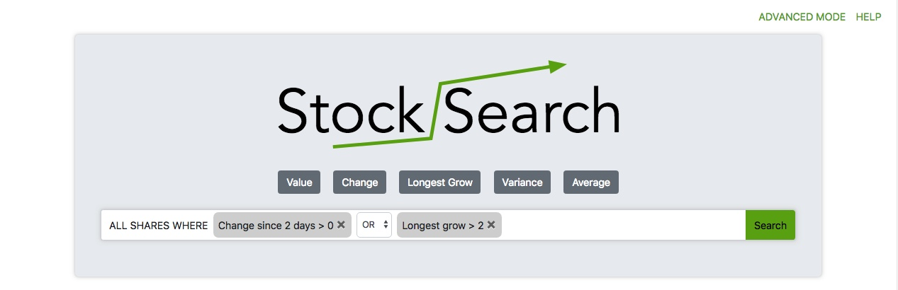

###Results

####Table Result

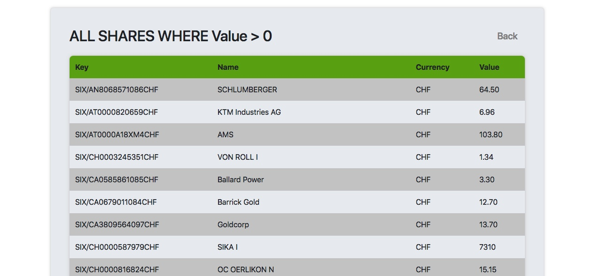

####Detail Result

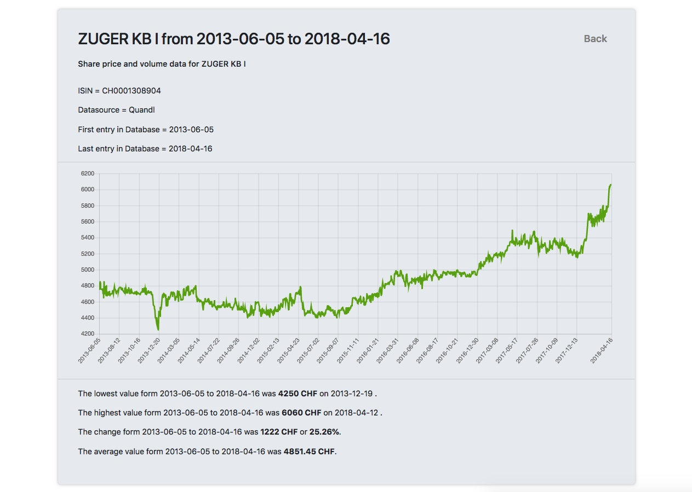

####Error

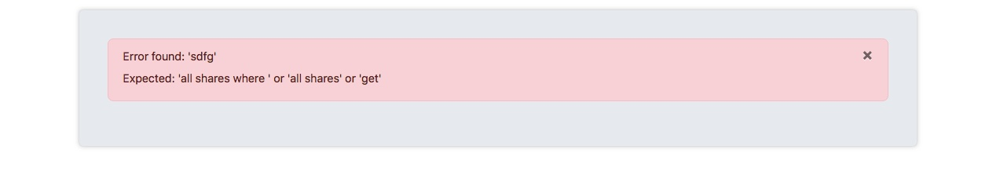

###HTML Layout  

Die Applikation ist besitzt ein einziges HTML-Dokument, welches in 2 teile unterteilbar ist. Die Sucheingabe und der Resultat teil. Die Elemente der Suche sind alle in dem HTML gespeichert, die Resultate jedoch werden dynamisch mit JavaScript eingefügt.  


###JavaScript Dateien Übersicht


Die Applikation ist besitzt ein einziges HTML Dokument, welches in 2 teile unterteilbar ist. Die Sucheingabe und der Resultatteil. Die Elemente der Suche sind alle in dem HTML gespeichert, die Resultate jedoch werden dynamisch mit JavaScript eingefügt. 


###JavaScript Dateien Übersicht

Es hat 3 verschiedene JavaScript Dokumente welche für die Logik und anzeige zuständig sind:

- main.js  
Diese Datei enthält die Haupt Logik der Webseite.
- easyMode.js  
Diese Datei enthält die Logik und die Anzeigeeigenschaften für den Easy Mode.
- results.js  
Diese Datei ist zuständig für die Anzeige der Resultate der verschiedenen Suchen.

####main.js

Die 3 wichtigsten Methoden dieser Datei sind:

- getResults  
Diese Methode nimmt ein SSQL Suchabfrage als Argument und sendet diese mit Ajax an die API. Die Antwort wird nach Typ sortiert und an die jeweilige Funktion im results.js weitergeleitet.


- changeMode  
Diese Funktion wechselt die  Ansicht der Suchabfrage. Dies geschieht indem bei den jeweiligen Elementen das Style Display Attribut angepasst wird.

- goBack  

Damit der Benutzer die vorhergegangene Abfrage wiederholen kann, werden die SSQL abfragen im Session-Storage gespeichert. Beim betätigen des Back Link, wird die letzte Abfrage aus dem Speicher gelesen und erneut ausgeführt.


####easyMode.js


#####Filters

Jeder Filter, der ein Benutzer im Easy Mode hinzufügen kann, besteht aus 2 Funktionen.

Wenn der jeweilige Filterknopf in der Easy Mode Ansicht angewählt wird, wird die Methode add[FILTERNAME]Filter aufgerufen.

Diese Funktion erzeugt ein Modal welches den Benutzer für die Argumente des jeweiligen Filters fragt. Beim betätigen des Save Knopf wird die Methode process[FILTERNAME]Filter aufgerufen.

Diese Funktion erzeugt aus den eingaben im jeweiligen Modal den HTML Code für diesen Filter und übergibt ihn der Funktion renderFilter welche den erzeugten code in den HTML DOM einfügt.

#####Processing the filters

Die vom Benutzer im Easy Mode hinzugefügte Filter, werden nach der Initialisierung im Dom gespeichert. Falls ein Filter hinzugefügt wird, muss geprüft werde, ob es der erste filter ist. 

Falls es der erste Filter ist wird der HTML code des Filters zusammen mit einem p element in einem div in dem ssql an der richtigen stelle eingefügt.

```
<div>
	<p> WHERE </p>
	<div class='filter'>
	...
	</div>
<div>

```

Falls es schon mehrere Filter gibt wird er mit einem dropdown Menu in einem div gespeichert. Dieses div wird dan an der richtigen stelle eingefügt.


```
<div>
	<div id='concat'>
		<select>
			<option>OR</option>
			<option>OR</option>
		</select>
	</div>
	<div class='filter'>
	...
	</div>
<div>

```


Beim Klicken auf den Search Knopf im Easy Mode wird die Funktion getEasyResults aus dem HTML-DOM die SSQL suche extrahieren und an der Methode getResults, welche sich im main.js Dokument befindet, weitergeben.


Beim Klicken auf das **x** eines Filters im Easy Mode, wird die Funktion deleteFilter aufgerufen. Als argument wird das äussere div mitgegeben, welche entweder das ```div#concat``` oder das ```p``` Element enthält. Falls es mehr aus 2 filtern in dem ssql statement hat und der erste filter mit der Where Klausel gelöscht wird, muss das ```div#concat``` in das ```p``` Element geändert werden.

Dammit die Auswahl der select Optionen bei einer Änderung gespeichert bleibt, wird beim select onChange die Methode persistConcatState ausgeführt, welche die Reihenfolge der option Elemente dieses selectes vertauscht.

####results.js

Es gibt 3 verschiedene Antwortarten:

- table  
Bei einer SSQL suche wird eine Tabelle als key value array mit den Daten der Verschiedene Aktien und deren Attribute zurückgegeben. Diese werden als Tabelle im HTML gespeichert und angezeigt.

- details  
Falls der Benutzer die Daten einer Aktie analysieren möchte, kann er in der Tabelle die jeweilige Zeile anwählen. Die Aktienkurse werden danach mit Hilfe von Chart.js angezeigt. 

- error  
Falls eine suche ein Fehler enthält, wird von der API ein Fehler zurückgegeben, welche danach im HTML angezeigt wird.

## SSQL

Im folgenden ist die gesammte Grammatik der SSQL-Statements in der erweiterten Backus-Naur-Form definiert. Für eine bessere Erklärung einzelnen Statements sehen Sie sich bitte das SSQL-Tutorial an.

### Statements
```
Statement = ( AllStatement | AllWhereStatement | Detail );

AllStatement = 'all shares';

AllWhereStatement = 'all shares where ', Condition;

Detail = 'get', String;
```
### Conditions
```
Condition = ( CombinedCondition | FunctionCompareCondition |
            ParenthesedCondition | BooleanCondition );
            
CombinedCondition = ( FunctionCompareCondition | ParenthesedCondition |
                    BooleanCondition ), BoolOperator, Condition;        

FunctionCompareCondition = Function, Comperator, Function;

BooleanCondition = ( 'true' | 'false' );

ParenthesedCondition = '(', Condition, ')';

```
### Funktionen
```
Function = ( Decimal | Value | Change | Variance | Average | LongestGrow );

Average = 'average', [Timespan];

Decimal = ['-'], ? WORD('0-9') ?, ['.', ? WORD('0-9') ?], ['%'];

LongestGrow = 'longest grow', [Timespan];

Value = 'value', ['on', Date];

Variance = 'variance', [Timespan];

Change = ['absolute'], 'change', Timespan;

```
### Datum und Zeit
```
Date = ? WORD('0-9') ?, '-', ? WORD('0-9') ?, '-', ? WORD('0-9') ?;

Timespan = ( SinceDays | SinceDate | FromTo );

FromTo = 'from', Date, 'to', Date;

SinceDate = 'since', Date;

SinceDays = 'since', PosInteger, 'days';

```
### Verschidenes
```
BoolOperator = ( 'and' | 'or' );

Comperator = ( '!=' | '>' | '>=' | '=' | '<=' | '<' );

PosInteger = ? WORD('0-9') ?;

String = ( "'", AnythingButQuotation, "'" | '`', AnythingButQuotation, '`' |
         '"', AnythingButQuotation, '"' );
```

## Funktionsweise Engine

### Prinzip

Ein geparstes SSQL-Statement wird im Speicher als Baum von Objekten repräsentiert, wobei jeweils das Eleternelement eine Objektreferenz auf das Kindelement besitzt. Folgend dient zum besseren Verständnis ein mögliches Objektdiagram welches das Statement **ALL shares WHERE (value on 2018-03-05 > 100) OR change from 2016-01-01 to 2016-06-31 >= 0.1** repräsentiert.

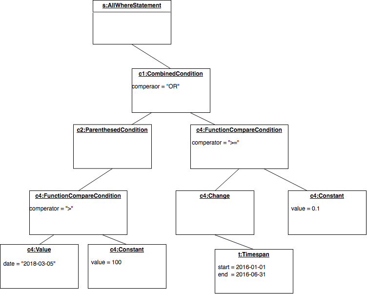

Für die Generierung eines SQL-Statement welches von der Datenbank verarbeitet werden kann wird nun rekursiv die Funktion get_sql() aufgerufen und somit das Statement zusammengesetzt. Dabei gelten folgende Bedingungen:

#### Funktionen
Eine Funktion kann als Mathematische Funktion angesehen werden, welche jedem Aktientitel (Definitionsmenge) eine reelle Zahl (Bildmenge) zuordnet. Beispielsweise mapt die Funktion Value mit dem Parameter date=2018-01-01 jede Aktie auf ihren wert zu diesem Datum. Falls Dann kein Wert vorhanden sein solle, muss die Funktion entweder null oder 0 zurückgeben. Konstanten werden einfachheitshalber auch als Funktionen dargestellt, diese geben somit einfach die gleiche Zahl für alle Aktientitel zurück.

Funktionen werden später alle innere Selects verwendet. Deswegen muss die Funktion get_sql() für alle Funktionsobjekte ein SQL-Statement zurückgeben welches für jede Aktie ein Tuppel aus id und wert zurückgibt. Später wird danach einen Inner-Join auf alle Funktionen über die id berechnet, somit können dann die Funktionswerte pro Aktie verglichen werden.

#### Conditions

Conditions werden mit AND und OR verknüpft. Folglich müssen conditions einen boolesche Wert für alle Aktien zurückgeben können. In der Engine ist dies folgender massen umgesetzt:

Conditions müssen ein Template und eine Liste von Funktionsobjekten zurückgeben. Die Liste der Funktionen wird erstellt in dem rekursiv auf alle Kinderobjekte dieselbe Operation angewendet wird. Das Template ist ein String, in welchen danach nur noch die Namen der Funktionen eingesetzt werden können.

Beispielsweise gibt die condition **value on 2018-01-01 > 10**
Die beiden Funktionen [(value on 2018-01-01), (constant 10)] sowie das Template `{} > {}` zurück. Damit kann das Statement Objekt alle benötigten Funktionen joinen, danach in das Template die Namen der in sql inneren Statements einsetzten, und das Template als Filter im SQL-Statement benützten.

##### Beispiel
Das Statement **all shares where value on 2018-01-01 > 10** besteht aus einer Condition und zwei Funktionen.

Die erste Funktion ist **value on 2018-01-01** und liefert das folgende innere SQL-Statement: 
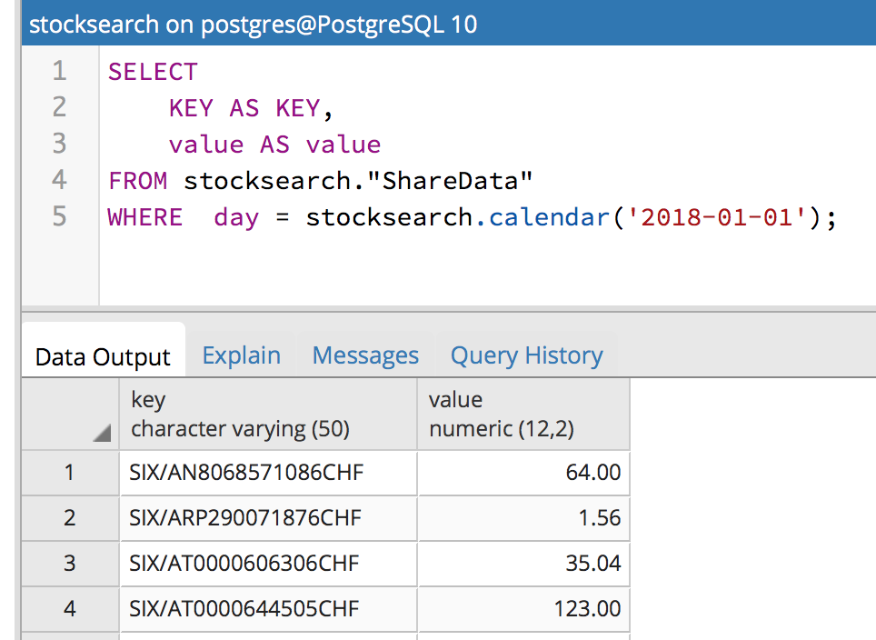

Die einfache Konstante 10 liefert das SQL-Statement:
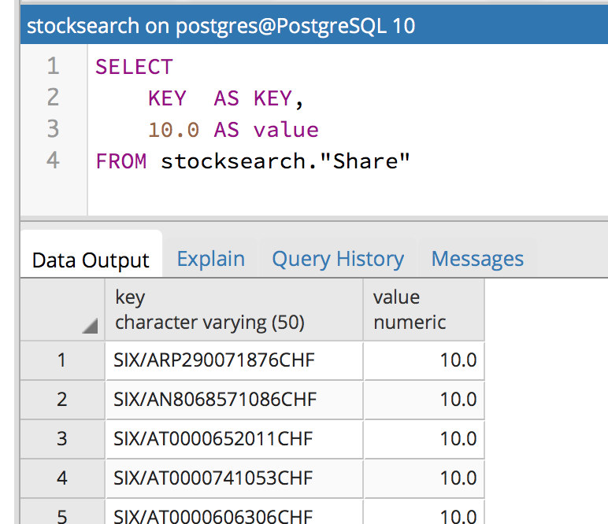

Danach wird folgendermassen gejoint:
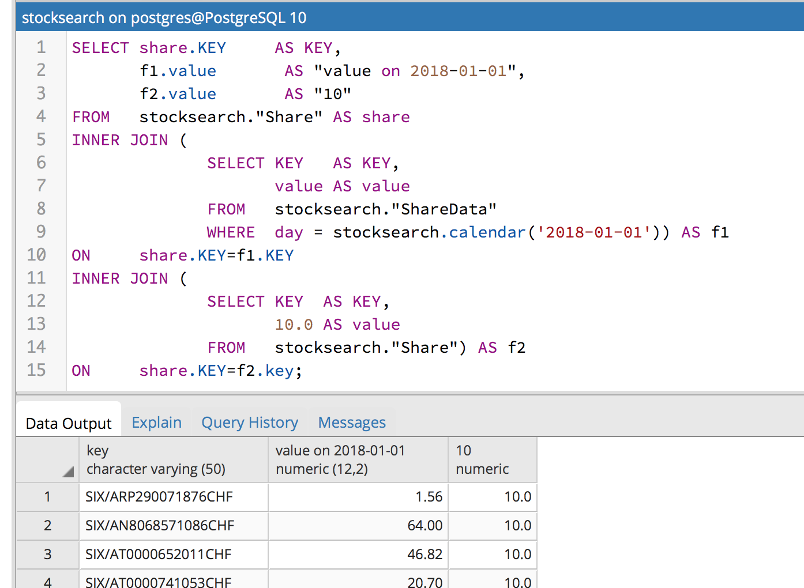

Schlussendlich wird nur noch das Template als Filter angewendet und noch die zusätzlichen Metadaten im Select erfasst und wir erhalten das folgende SQL-Statement:

```
SELECT share.KEY     AS KEY,
       share.NAME     AS NAME,
       share.currency AS currency,
       f1.value       AS value on 2018-01-01
FROM   Stocksearch."Share" AS share
INNER JOIN (
              SELECT KEY   AS KEY,
                     value AS value
              FROM   stocksearch."ShareData"
              WHERE  day = stocksearch.calendar('2018-01-01')) AS f1
ON     share.KEY=f1.KEY
INNER JOIN (
              SELECT KEY  AS KEY,
                     10.0 AS value
              FROM   stocksearch."Share") AS f2
ON     share.KEY=f2.key
WHERE f1 > f2
```
Man beachte das die Alle Funktionen ausser die Konstanten im select Bereich zurückgegeben werden.
Umsetzung
Mit diesem Prinzip können die Funktionen in SQL beliebig ausgetauscht und erweitert werden. Jedes Funktionsobjekt muss einfach die Bedingung erfüllen das es ein SQL-Statement mit welches als Inner-Statement verwendet werden kann und die Felder "key" und "value" enthält.

Auf die genaue Beschreibung der Umsetzung der anderen Funktionen verzichten wir an dieser stellen, man siehe dazu die Dokumentation im Quellcode der Engine an. Allerdings möchten wir noch auf die Funktion Longest Grow zu sprechen kommen, da diese auf eine etwas andere Art umgesetzt ist.

#### Longest Grow

Die Funktion LongestGrow gibt die Anzahl Tage der längsten Periode jedes Aktientitel zurück, in welcher der Wert jeden Tag gestiegen ist. Da dies mit Standart-SQL sehr schwer umzusetzen ist haben wir dazu eine eigene Aggregatsfunktion in Postgres erstellt.

Die Funktion get_sql von LongestGrow liefert also folgendes inneres SQL-Statement zurück:

```
/* Longest strike */
SELECT
	key as "key",
	CAST (longest_strike("value" ORDER BY "day") AS numeric ) as "value"
FROM
	stocksearch."ShareData"
WHERE
	day >= calendar_start() AND day <= calendar_end()
GROUP BY key
```

Dazu haben wir die Funktion longest_strike() in psql folgendermassen implementiert.

Wir haben eine Left-Folding Reduce-Funktion erstellt. 


Source Wikipedia: https://en.wikipedia.org/wiki/Fold_(higher-order_function)

Dazu benötigen wird einen State welcher jeweils aktualisiert wird.

```
CREATE TYPE longest_strike_state as (
    currentStrike       integer,
    longestStrike       integer,
    lastValue           decimal
);
```

Die Reduce-Funktion wird nun für alle Dateneinträge jeder Aktie der Reihe nach aufgerufen und aktualisiert jeweils den aktuellen State.

```
/* This function updates the state for each value in the reduce*/
CREATE OR REPLACE FUNCTION longest_strike_reduce(s longest_strike_state, v decimal) RETURNS longest_strike_state AS $$
	BEGIN
		IF s.lastValue != -1 AND v > s.lastValue THEN
			s.currentStrike = s.currentStrike + 1;
		ELSE
			/* The strike is finished */
			s.currentStrike = 0;
		END IF;
		
		IF s.currentStrike > s.longestStrike THEN
				s.longestStrike = s.currentStrike;
		END IF;
		s.lastValue = v;
		return s;
	END;
$$ LANGUAGE plpgsql;
```
Nun müssen wir nur noch die aggregatsfunktion in Postgres erstellen in dem wir einen initialen State angeben, zusammen mit der Reduce-Funktion und einer Funktion welchen den Wert aus dem finalen State selektiert.

```
/* This function pickes the final value out of the state of the reduce function*/
CREATE OR REPLACE FUNCTION longest_strike_finalizer(s longest_strike_state) RETURNS integer AS $$
	BEGIN
		return s.longestStrike;
	END;
$$ LANGUAGE plpgsql;

/* And this composes everything to one function*/
CREATE AGGREGATE longest_strike(decimal)
(
	sfunc = longest_strike_reduce,
	finalfunc = longest_strike_finalizer,
	stype = longest_strike_state,
    initcond = '(0,0,-1)'
);
```

### Klassendiagram

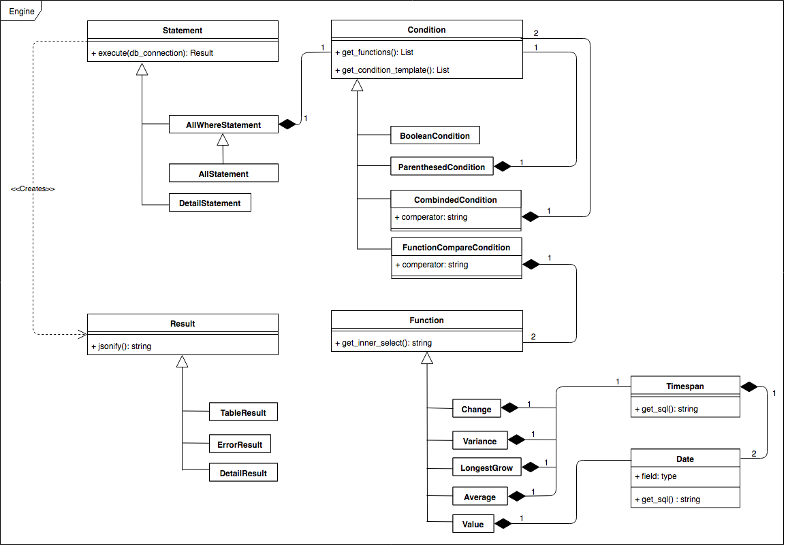

## Funktionsweise Parser

Für das Parsing der einkommenden SSQL-Statements verwenden wir die Bibliothek Modgrammar, welche ein sehr einfach verständliches Interface bietet.

Modgrammar funktioniert so, dass man die Klasse Grammar erweitert. Im folgenden Beispiel, kopiert aus der offiziellen Dokumentation, ist dies ersichtlich.

```python
from modgrammar import *

grammar_whitespace_mode = 'optional'

class MyGrammar (Grammar):
    grammar = (LITERAL("Hello,"), LITERAL("world!"))
    
myparser = MyGrammar.parser()
result = myparser.parse_text("Hello, world!")
```

Um nun ein Syntaxbaum der Engine zu erstellen benutzen wir das Konzept der Mehrfachvererbung welches Python unterstützt.
Dazu erstellten wir eine Unterklasse für jede benötigte Klasse auf dem Engine-Package welche gleichzeitig auch noch von der Klasse Grammar vom Modgrammar-Package erbt. Deutlich wird dies am folgenden Auszug aus dem Source-Code des Parser-Package.

```python
class FunctionCompareCondition(Grammar, eg.FunctionCompareCondition):

    grammar = (REF("Function"), REF("Comperator"), REF("Function"))
    
    def grammar_elem_init(self, _):
        self.leftFunction = self[0]
        self.comparator = self[1].string
        self.rightFunction = self[2]
```
Mit der grammar_elem_init() wird nach der Istanzierung der Klasse durch Modgrammar die nötigen Attributgesammtee der Engine-Superklasse gesetzt.

Mit diesem Prinzip wird der gesammte abstrakte Syntaxbaum initialisiert und kann danach von der Engine verarbeitet werden.

### Klassendiagram

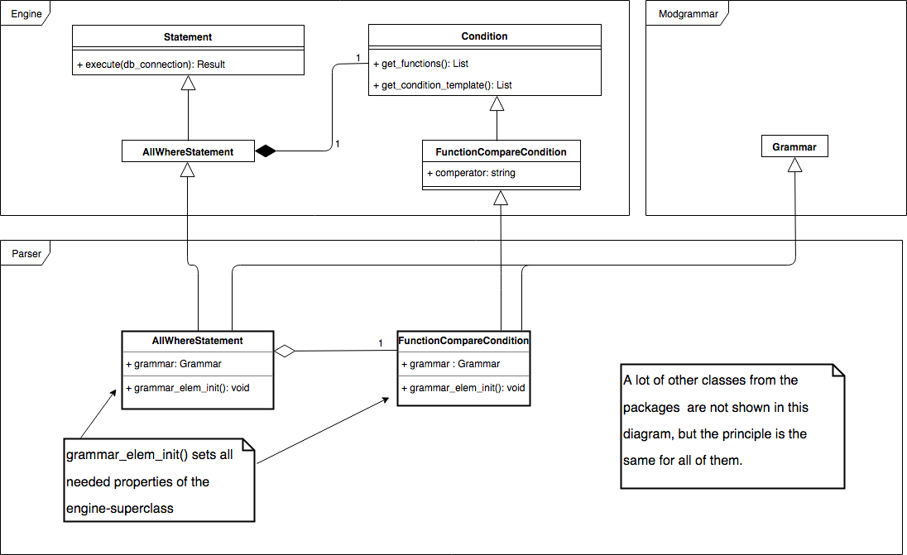


## Verwendete Frameworks / Softwarebibliotheken

Es wurde ausschlisslich Open-Source Software verwendet.

#### Engine:

##### Python 3
Programmiersprache

- https://www.python.org/
- Python Software Foundation License

##### Flask 0.12.2
Web Microframwork für Python

- http://flask.pocoo.org/
- BSD License

##### Modgrammar 0.10
Parsing library

- https://pythonhosted.org/modgrammar/
- New BSD License

##### PostgreSQL 10
SQL Datenbanksystem

- https://www.postgresql.org/
- PostgreSQL License

##### Pytest 3.4.2
Testframework für Python

- https://www.pytest.org
- MIT licence

##### Pg8000 1.11.0
Postgres Datenbank Connector für Python 3

- https://pypi.org/project/pg8000/
- BSD licence

##### Pytest-coverage 4.5.1
Code coverage measurement for Python

- https://bitbucket.org/ned/coveragepy
- Apache 2.0 licence

###Client
#####Bootstrap 4
  
Front-end component library

- <https://getbootstrap.com/>  
- MIT licence and copyright 2018 Twitter

#####JQuery

JavaScript library to simplify HTML modifications

- <http://jquery.com/>  
- MIT licence

#####Tablesorter

Plugin to create sortable tables

- <http://tablesorter.com>  
- MIT and GLP licence

#####Jalc
Plugin for client side caching

- <https://github.com/SaneMethod/jquery-ajax-localstorage-cache>
- Apache License

#### Verschiedenes

##### MkDocs 0.17.3
Static site generator

- http://www.mkdocs.org/
- BSD licence